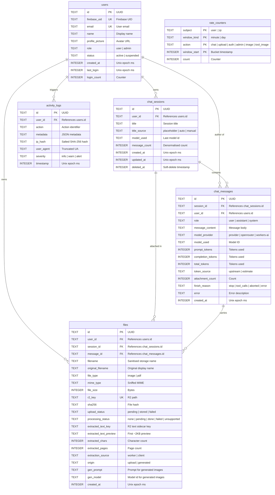

# Codebase Review: ChatDDB

## 1. Project Overview

### Purpose
**ChatDDB** is a full-stack, ChatGPT-style generative AI conversational web application built specifically for academic and technical environments (predominantly engineering students and technical researchers). It provides a responsive, single-page conversational interface that streams answers from state-of-the-art Large Language Models (LLMs), allows multimodal input (image analysis and document/PDF extraction), executes in-chat image generation, and renders complex technical diagrams dynamically as scalable vector graphics (SVG).

### Main Use Cases
1. **Interactive Technical Chat**: Conversational problem solving, code analysis, mathematical derivation, and engineering tutoring using models like `deepseek-v4-flash`, `glm-5.3`, `gpt-5.6-sol`, and `claude-opus-5`.
2. **Document & Image Analysis**: Uploading PDFs (e.g. lab sheets, lecture slides) and images (diagrams, circuits, plots) for contextual analysis and question answering.
3. **Symbolic Technical Diagrams**: Real-time rendering of mathematical curves, Bode plots, pole-zero plots, free-body diagrams, and electronic schematics generated by the model as SVG markup with interactive zoom, pan, and SVG/PNG export.
4. **Image Generation**: Generating photorealistic or artistic images either explicitly via an image prompt composer or autonomously mid-conversation via tool calling (`generate_image`).
5. **Audited Multi-User Management**: Providing role-based access control (regular users vs. administrators), activity logging, suspension/promotion capabilities, usage statistics, and audited transcript inspection for administrative oversight.

### Intended Users
- **Students & Researchers**: Asking technical questions, analyzing documents, and viewing complex scientific diagrams.
- **Instructors / System Administrators**: Monitoring platform utilization, reviewing anonymized usage, moderating accounts, and inspecting anomalous or suspicious activities.

### Main Technologies and Frameworks
- **Frontend**:
  - React 19 (`19.2.7`) with TypeScript (`~6.0.2`)
  - Vite 8 (`8.1.1`) with Rollup chunk splitting
  - Tailwind CSS 4 (`@tailwindcss/vite` 4.3.3)
  - `react-markdown` 10 + `remark-gfm`, `remark-math`, `rehype-highlight`, `rehype-katex`
  - KaTeX (`0.18.1`) for LaTeX mathematical typesetting
  - Highlight.js (`11.11.1`) for syntax highlighting
  - DOMPurify (`3.4.12`) for client-side SVG sanitization
  - PDF.js (`pdfjs-dist` 6.2.108) running in a Web Worker for client-side PDF text extraction
  - Lucide React (`1.27.0`) for icons
  - Firebase Client SDK (`12.16.0`) for client-side Google Authentication
- **Backend & Cloud Infrastructure**:
  - Cloudflare Workers (Workerd runtime, `compatibility_date: 2026-07-01`, `nodejs_compat`)
  - Cloudflare D1 (Serverless SQLite) with versioned migrations
  - Cloudflare R2 (S3-compatible object storage) for uploads, generated images, and extracted text sidecars
  - Cloudflare Workers AI (`@cf/black-forest-labs/flux-1-schnell`) for fast image generation
  - `jose` (`6.2.4`) for stateless RS256 JWT verification against Google's public JWKS
  - HTMLRewriter (Cloudflare streaming HTML/SVG parser) for server-side SVG sanitization
  - WebCrypto API for cryptographic operations (SHA-256, HMAC-SHA256, UUIDv4)
- **AI Providers & Gateways**:
  - **Primary Text Provider**: OpenAI-compatible endpoint (AgentRouter / custom gateway)
  - **Text Backup Gateway**: OpenRouter free-tier backup (`z-ai/glm-5.2:free`)
  - **Primary Image Provider**: Cloudflare Workers AI
  - **Image Backup Provider**: Pollinations AI (`https://gen.pollinations.ai`, `flux` model)

### Overall Application Architecture
ChatDDB is architected as a **unified Cloudflare Worker deployment**. The Cloudflare Worker acts both as the API backend at `/api/*` and as the static asset server for the built React single-page application (`dist/`). Asset routing rules in `wrangler.jsonc` ensure that `/api/*` is always routed to the worker handler first, while any unmatched static routes resolve to `dist/index.html` to enable client-side routing.

---

## 2. Repository Structure

```
ChatDDB/
├── .analysis/                     # Internal production analysis artifacts (gitignored)
├── .claude/                       # Claude settings / tool configurations
├── .dev.vars.example              # Template for local Worker secrets
├── .env.local.example             # Template for public frontend Firebase variables
├── .oxlintrc.json                 # Oxlint linter configuration
├── DOCS.md                        # Exhaustive technical documentation
├── index.html                     # HTML shell for Vite application
├── migrations/                    # D1 SQLite SQL migration files
│   ├── 0001_users_and_activity.sql
│   ├── 0002_chat_sessions_and_messages.sql
│   ├── 0003_files.sql
│   ├── 0004_rate_counters.sql
│   ├── 0005_session_title_provenance.sql
│   └── 0006_generated_images.sql
├── package.json                   # NPM package scripts and dependencies
├── public/                        # Static assets (favicons, headers)
│   └── _headers                   # Cloudflare Pages / Workers static response headers (CSP, WASM)
├── README.md                      # High-level architecture and quickstart guide
├── scripts/                       # Maintenance, probe, and smoke testing scripts
│   ├── figure-gate-harness/       # Worker harness for testing FigureGate in workerd
│   ├── svg-sanitizer-harness/     # Worker harness for testing HTMLRewriter SVG sanitiser
│   ├── probe-openrouter.mjs       # Probe for querying OpenRouter free models
│   ├── probe-svg-diagrams.mjs     # Probe testing model SVG generation quality & restraint
│   ├── probe-tool-calling.mjs     # Probe testing model tool calling & streaming arguments
│   ├── probe-vision.mjs           # Probe testing multimodal vision support
│   ├── prune.mjs                  # Operator maintenance script for D1 and R2 data retention
│   ├── smoke.mjs                  # Playwright/Edge headless browser UI smoke test
│   ├── smoke-admin.mjs            # Smoke test for admin routes and permissions
│   ├── smoke-auth.mjs             # Smoke test for Firebase token verification
│   ├── smoke-backend.mjs          # Live streaming backend integration test
│   ├── smoke-chat-image-tool.mjs  # In-chat generate_image tool integration test
│   ├── smoke-edit.mjs             # Message edit and history truncation smoke test
│   ├── smoke-failover.mjs         # Text gateway failover integration test
│   ├── smoke-figure-gate.mjs      # SVG streaming figure gate test
│   ├── smoke-files.mjs            # File upload and signed URL smoke test
│   ├── smoke-image-failover.mjs   # Image generation crossover test (Workers AI -> Pollinations)
│   ├── smoke-images.mjs           # Workers AI image generation test
│   ├── smoke-mobile.mjs           # Mobile viewport and overlay sidebar test
│   ├── smoke-sse-null-frame.mjs   # Regression test for AgentRouter Claude null-frame bug
│   ├── smoke-svg-sanitizer.mjs    # HTMLRewriter SVG allowlist sanitization test
│   ├── smoke-tool-peek.mjs        # Stream lookahead tool peek test
│   ├── stub-gateway.mjs           # Local mock OpenAI server for failover tests
│   ├── stub-pollinations.mjs      # Local mock Pollinations server for image failover tests
│   └── test-failover.mjs          # Unit tests for provider chain resolution and filtering
├── src/                           # React 19 Frontend source code
│   ├── App.tsx                    # Root routing, auth gate, splash screen
│   ├── ChatApp.tsx                # Main conversational orchestrator, state, and event handling
│   ├── index.css                  # Global Tailwind CSS and custom theme styling
│   ├── main.tsx                   # React DOM root entry point
│   ├── types.ts                   # Frontend domain models (Conversation, Message)
│   ├── assets/                    # Static UI images and icons
│   ├── components/                # UI components
│   │   ├── AttachmentChip.tsx     # Preview chip for files attached to composer/messages
│   │   ├── AttachmentTray.tsx     # Staging tray for files queued to be sent
│   │   ├── ChatArea.tsx           # Scrollable message stream container
│   │   ├── CodeBlock.tsx          # Syntax-highlighted code block with language header & SVG switch
│   │   ├── Composer.tsx           # Multi-line message input, file picker, model picker
│   │   ├── CopyButton.tsx         # Clipboard copying helper
│   │   ├── LoginScreen.tsx        # Sign-in view with Google OAuth & unconfigured help
│   │   ├── Logo.tsx               # ChatDDB brand SVG mark
│   │   ├── MarkdownErrorBoundary.tsx # Error boundary protecting against rendering crashes
│   │   ├── MessageItem.tsx        # User and assistant bubble renderer with attachments
│   │   ├── ModelPicker.tsx        # Segmented control for picking active model
│   │   ├── Sidebar.tsx            # Session drawer, search, rename, delete, date grouping
│   │   ├── SvgFigure.tsx          # Interactive SVG renderer with DOMPurify, pan, zoom, export
│   │   ├── ThinkingIndicator.tsx  # Animated loading indicator for reasoning/thinking turns
│   │   ├── UserMenu.tsx           # Profile popup, sign out, admin link
│   │   └── admin/                 # Administration portal components
│   │       ├── AdminInspector.tsx # Cross-user conversation & file inspection drawer
│   │       ├── AdminPanel.tsx     # Admin dashboard, overview cards, charts, tabs
│   │       └── AdminUsers.tsx     # Paginated user management table with role/status controls
│   └── lib/                       # Frontend libraries and utilities
│       ├── adminApi.ts            # Client SDK for /api/admin/* endpoints
│       ├── api.ts                 # Chat streaming (SSE), session CRUD, image generation
│       ├── apiClient.ts           # Authorised fetch wrapper with token refresh & retry
│       ├── apiTypes.ts            # DTOs and API contracts matching backend shapes
│       ├── auth.tsx               # AuthContext, AuthProvider, profile synchronization
│       ├── fileUrl.ts             # Signed file URL caching and renewal hook
│       ├── firebase.ts            # Lazy Firebase Authentication initialization & Google popup
│       ├── image.ts               # Client-side image resizing and WebP conversion
│       ├── mathDelimiters.ts      # LaTeX delimiter normalizer (\(...\) -> $$...$$)
│       ├── pdfClient.ts           # Client-side pdf.js Web Worker text extractor
│       ├── router.ts              # Minimal browser history API router hook
│       ├── storage.ts             # LocalStorage helpers (theme, model preference, migration)
│       ├── streamingContext.ts    # React Context exposing in-flight stream state
│       ├── theme.ts               # Dark/light theme management
│       └── upload.ts              # XHR multipart upload wrapper with progress events
├── vite.config.ts                 # Vite bundler configuration & local proxy setup
├── worker/                        # Cloudflare Worker Backend source code
│   ├── env.ts                     # Environment schema, defaults, policy parsing
│   ├── failover.ts                # Primary <-> OpenRouter failover orchestration
│   ├── images.ts                  # Workers AI <-> Pollinations image chain & error handling
│   ├── index.ts                   # Worker fetch router, route table, public health handler
│   ├── models.ts                  # Model registry, vendor definitions, capability flags
│   ├── provider.ts                # Upstream OpenAI-compatible HTTP client & retry ladder
│   ├── sse.ts                     # SSE normalizer, tool peek lookahead, figure gate pump
│   ├── auth/                      # Authentication & authorization middleware
│   │   ├── middleware.ts          # RequestContext builders, requireAuth, requireAdmin
│   │   └── verify.ts              # RS256 JWT verification via Google JWKS (jose)
│   ├── db/                        # D1 database services
│   │   ├── activity.ts            # Activity log insertions and query aggregations
│   │   ├── client.ts              # D1 client helpers, parameterized query guards, batching
│   │   ├── files.ts               # File metadata queries, storage statistics, upload tracking
│   │   ├── messages.ts            # Message insertion, server-authoritative history rebuild
│   │   ├── sessions.ts            # Session CRUD, auto-titling heuristics, soft-delete
│   │   └── users.ts               # User upsert on login, role/status mutations, DAU metrics
│   └── lib/                       # Worker utility modules
│       ├── figureGate.ts          # Streaming buffer gating ```svg fences until complete
│       ├── hash.ts                # WebCrypto SHA-256, HMAC-SHA256, salted IP hash, UUID
│       ├── http.ts                # API error models, CORS allowlist, JSON response formatters
│       ├── ratelimit.ts           # D1 absolute-window bucket rate limiter
│       ├── sanitizeSvg.ts         # HTMLRewriter SVG tag and attribute allowlist sanitiser
│       ├── suspicious.ts          # Background heuristics for flagging abuse patterns
│       ├── validate.ts            # Request payload parsers, limits, UUID validators
│       └── files/                 # File processing utilities
│           ├── context.ts         # Bounded document context chunking & prompt prepending
│           ├── detect.ts          # Magic-byte file sniffer & filename sanitizer
│           ├── pdf-client.ts      # Client-supplied extraction ingestion & storage
│           └── pdf-worker.ts      # Server-side unpdf extractor (Worker Paid path)
├── worker-configuration.d.ts      # Wrangler auto-generated binding types
└── wrangler.jsonc                 # Cloudflare Worker & Pages configuration
```

---

## 3. Application Architecture

### High-Level System Overview
ChatDDB operates as an edge-native, decoupled full-stack application running entirely within Cloudflare's edge network:

```mermaid
flowchart TB
    subgraph Browser ["Client Browser (React 19 SPA)"]
        UI[User Interface & ChatApp]
        AuthHook[useAuth / AuthProvider]
        FirebaseSDK[Firebase Client SDK]
        PDFWorker[pdf.js Web Worker]
        CanvasImg[Canvas Image Pre-scaler]
        DOMPurifySan[DOMPurify SVG Sanitiser]
    end

    subgraph Edge ["Cloudflare Global Network (Edge Worker)"]
        Router[worker/index.ts - Router & Route Guards]
        AuthMid[auth/middleware.ts - requireAuth / requireAdmin]
        JWKSVerify[auth/verify.ts - jose RS256 Google JWKS]
        ChatRoute[routes/chat.ts - Conversational Engine]
        ImageRoute[routes/images.ts - Image Generator]
        FileRoute[routes/files.ts - Upload & Signed URLs]
        AdminRoute[routes/admin.ts - Administration API]
        RateLimiter[lib/ratelimit.ts - Absolute Bucket Limiter]
        FigGate[lib/figureGate.ts & sanitizeSvg.ts]
        UpstreamClient[provider.ts & failover.ts]
    end

    subgraph Storage ["Edge Persistence & Storage"]
        D1[(Cloudflare D1 SQLite)]
        R2[(Cloudflare R2 Bucket)]
    end

    subgraph External ["External Services & AI Gateways"]
        GoogleJWKS[Google Secure Token JWKS Endpoint]
        PrimaryAI[Primary API Gateway - AgentRouter]
        BackupAI[Backup Text Gateway - OpenRouter]
        WorkersAI[Cloudflare Workers AI - Flux Schnell]
        Pollinations[Pollinations AI - Flux Backup]
    end

    %% Auth Flow
    UI -->|Sign In / Google Popup| FirebaseSDK
    FirebaseSDK -->|Fetch ID Token| UI
    UI -->|POST /api/auth/session| Router
    Router --> AuthMid
    AuthMid --> JWKSVerify
    JWKSVerify -.->|Fetch Public Keys| GoogleJWKS
    AuthMid -->|Upsert User & Role Check| D1

    %% Chat & Streaming Flow
    UI -->|POST /api/chat Stream Turn| Router
    Router --> AuthMid
    AuthMid --> RateLimiter
    RateLimiter <-->|Check/Incr Counters| D1
    AuthMid --> ChatRoute
    ChatRoute -->|Rebuild Context from DB| D1
    ChatRoute --> UpstreamClient
    UpstreamClient -->|Stream Request| PrimaryAI
    PrimaryAI -.->|Failover on Error| BackupAI
    UpstreamClient -->|Peek Tool Calls| FigGate
    FigGate -->|Emit Normalised SSE| UI
    ChatRoute -.->|Async Post-Stream Save| D1

    %% Tool Calling Flow
    PrimaryAI -->|tool_call: generate_image| ChatRoute
    ChatRoute --> ImageRoute
    ImageRoute --> WorkersAI
    WorkersAI -.->|Failover on Quota| Pollinations
    ImageRoute -->|Put Generated Image| R2
    ImageRoute -->|Insert File Record| D1

    %% File Upload Flow
    UI -->|Extract Text| PDFWorker
    UI -->|Pre-scale Image| CanvasImg
    UI -->|POST /api/files Multipart| Router
    Router --> FileRoute
    FileRoute -->|Put Raw Object & Extracted Text| R2
    FileRoute -->|Insert File Metadata| D1

    %% Signed File View Flow
    UI -->|GET /api/files/:id/url| Router
    Router --> FileRoute
    FileRoute -->|Return HMAC Signed URL| UI
    UI -->|GET /api/files/view?sig=...| Router
    Router -->|Verify HMAC & Stream Object| R2

    %% Diagram Flow
    UI --> DOMPurifySan
```



### Data Flow Summaries
1. **Chat Interaction**:
   - The user types a message. The client posts only `{ sessionId, content, attachments, model }` to `/api/chat`.
   - The Worker verifies the Bearer ID token, checks the user row in D1, checks rate limits in D1, verifies attachment ownership, and **rebuilds the conversation history server-side from D1** (limiting to 30 turns / 500,000 characters).
   - Upstream completion is initiated via the provider chain.
   - If the model emits a `generate_image` tool call, the worker pauses client streaming, generates the image via Workers AI / Pollinations, commits it to R2 and D1, and passes the result back upstream to receive a final text answer.
   - If the model emits ```` ```svg ````, the `FigureGate` holds the block until complete, sanitizes it via `HTMLRewriter`, and streams it.
   - As tokens arrive, they are delivered as SSE to the client. After completion, `ctx.waitUntil` asynchronously saves the assistant turn, updates session timestamps, recalculates token usage, and automatically generates session titles if needed.
2. **File Storage & Viewing**:
   - Files are uploaded via `multipart/form-data` to `POST /api/files`. The worker sniffs magic bytes (`detectType`), rejects SVGs, limits sizes (10 MB for images, 25 MB for PDFs), writes the binary to R2 (`u/<userId>/<year>/<month>/<fileId>.<ext>`), and records metadata in D1.
   - Files are never publicly exposed. To render an image or download a PDF, the client asks `GET /api/files/:id/url`. The server validates ownership and mints an HMAC-SHA256 signed capability URL with a 5-minute TTL. The browser fetches `GET /api/files/view?id=...&exp=...&sig=...` without needing an `Authorization` header.

---

## 4. Application Entry Points

### Frontend Startup (`src/main.tsx` & `src/App.tsx`)
1. **HTML Initialization**: The browser loads `index.html`, which imports `src/main.tsx`.
2. **Style & KaTeX Loading**: `main.tsx` imports `katex/dist/katex.min.css` followed by `src/index.css` to ensure KaTeX math fonts and Tailwind CSS 4 utility classes are loaded with correct specificity.
3. **DOM Mounting**: `createRoot` mounts `<AuthProvider>` wrapping `<App />` inside `<StrictMode>`.
4. **Auth State Resolution (`src/lib/auth.tsx`)**:
   - `AuthProvider` checks `isFirebaseConfigured()`. If `VITE_FIREBASE_*` variables are missing, `unconfigured` is set to `true`, bypassing initialization and immediately displaying the configuration help view.
   - When configured, `getFirebaseAuth()` lazily imports and initializes Firebase Auth with `browserLocalPersistence` (IndexedDB).
   - `onIdTokenChanged` listens for authentication state. If no user is logged in, `initialising` flips to `false`, causing `App.tsx` to render `<LoginScreen />`.
   - If a Google user is authenticated, `establish(user)` calls `POST /api/auth/session` with the token.
   - On success, the D1 `PublicUser` record is saved, `GET /api/me` is invoked to load quotas and model lists, and `initialising` flips to `false`.
5. **View Selection (`src/App.tsx`)**:
   - If `initialising`: Displays `<Splash />` (centered brand logo).
   - If `!profile`: Displays `<LoginScreen />`.
   - If URL path starts with `/admin`:
     - If `profile.role === 'admin'`: Renders `<AdminPanel />`.
     - Otherwise: Renders `<NotAllowed />` access denied view.
   - Otherwise: Renders `<ChatApp />`.

### Backend Startup (`worker/index.ts`)
1. **Worker Instantiation**: Cloudflare Workers instantiate the exported object satisfying `ExportedHandler<WorkerEnv>`:
   ```typescript
   export default {
     async fetch(request: Request, env: WorkerEnv, exec: ExecutionContext): Promise<Response>
   }
   ```
2. **Path Normalization & Route Matching**:
   - Trailing slashes are stripped.
   - If path does not begin with `/api/`, the request returns a 404 JSON response (since `run_worker_first: ["/api/*"]` in `wrangler.jsonc` passes non-API requests to static asset routing).
   - Handles `OPTIONS` HTTP preflight requests using `preflight(request, env)`.
   - Evaluates `ROUTES` table to match path patterns (`/api/sessions/:id`) and method.
   - If a path matches but with a different HTTP method, returns a compliant `405 Method Not Allowed` with an `Allow` header.
3. **Context Construction & Guard Enforcement**:
   - `buildContext(request, env, exec)` constructs `RequestContext` (attaches client IP hash, user agent, URL, and parsed policy).
   - If route guard is `'public'`: Calls route handler directly with `RequestContext`.
   - If route guard is `'user'`: Invokes `requireAuth(ctx)`, validating the Bearer JWT, checking D1 user existence and suspension status, producing an `AuthedContext`.
   - If route guard is `'admin'`: Invokes `requireAdmin(ctx)`, ensuring `user.role === 'admin'`. Non-admin hits are recorded as `suspicious_activity` in `activity_logs`.
4. **Error Handling**: Any thrown exceptions are captured by `errorResponse(err, request, env)`, returning normalized `{ error: { message, type } }` JSON payloads with appropriate HTTP status codes (e.g. 400, 401, 403, 404, 413, 429, 500, 503).

---

## 5. Frontend Architecture

### Component Hierarchy
```
App
├── Splash (when initialising)
├── LoginScreen (when not authenticated or unconfigured)
├── AdminPanel (when path === '/admin' and role === 'admin')
│   ├── Overview (Platform, storage, action stats, DAU charts)
│   ├── AdminUsers (Search, filter, pagination, user drawer, role/status actions)
│   └── AdminInspector (Cross-user sessions, transcript inspection, file preview)
└── ChatApp (main chat interface)
    ├── Sidebar (Conversation history, grouping by date, search, rename, delete)
    ├── UserMenu (Profile drawer, dark/light theme, admin navigation, sign out)
    ├── ChatArea
    │   └── MessageItem (Memoized user or assistant turn)
    │       ├── AttachmentChip (Uploaded file preview)
    │       ├── ThinkingIndicator (Pulsing loading state)
    │       ├── MarkdownErrorBoundary
    │       │   └── ReactMarkdown
    │       │       └── CodeBlock
    │       │           ├── SvgFigure (Interactive diagram viewer, zoom/pan/save)
    │       │           └── Highlighted code block with copy button
    │       ├── GeneratedImage (Full-size image display with save button)
    │       └── CopyButton
    └── Composer
        ├── ModelPicker (Segmented Auto/DeepSeek/GLM/ChatGPT/Claude control)
        ├── AttachmentTray (Pending file upload chips with progress)
        ├── Textarea (Auto-resizing message composer)
        └── Buttons (Attach file, Toggle image mode, Send, Stop)
```

### Layout and Navigation
- **Desktop**: Split layout with persistent or collapsible sidebar on the left and conversation/composer on the right.
- **Mobile**: Responsive hamburger menu that opens a sliding overlay drawer with full backdrop dismiss.
- **Client-Side Router (`src/lib/router.ts`)**: Lightweight URL router listening to `popstate` and managing navigation without heavy external routing dependencies. Supports `/` (chat) and `/admin` (management).

### State Management
- **React Contexts**:
  - `AuthContext` (`src/lib/auth.tsx`): Provides global auth state, user profile, quota limits, model registry, sign-in/sign-out actions.
  - `StreamingContext` (`src/lib/streamingContext.ts`): Exposes whether an individual assistant message is currently actively streaming.
- **Custom Hooks**:
  - `useAuth`: Accesses auth profile, remaining daily chat/image quotas, and admin status.
  - `useTheme` (`src/lib/theme.ts`): Controls `'light' | 'dark'` modes, synchronized with `localStorage` and `document.documentElement.classList`.
  - `useRoute` (`src/lib/router.ts`): Subscribes to browser path changes.
  - `useSignedImageUrl` (`src/lib/fileUrl.ts`): Caches and auto-renews 5-minute signed URLs for private R2 images.
- **Chat State (`src/ChatApp.tsx`)**:
  - `conversations`: List of conversation summaries.
  - `activeId`: Selected conversation ID.
  - `streaming`: Boolean indicating in-flight generation.
  - `pending`: Queue of attachments currently undergoing client-side pre-processing or upload.
  - `model`: Selected model override stored in `localStorage` (`loadModelChoice`).

### API Communication
- **Central Authorized Fetch (`src/lib/apiClient.ts`)**:
  - All calls to `/api/*` pass through `apiFetch` or `apiJson`.
  - Automatically attaches `Authorization: Bearer <idToken>`.
  - Excludes ambient credentials (`credentials: 'omit'`).
  - Implements **transparent token refresh on HTTP 401**: If a 401 error occurs, it force-refreshes the Firebase token once and replays the request before failing.
  - On `account_suspended` or unrecoverable session failure, invokes `onSessionLost`, resetting auth state and signing out of Firebase.
- **Streaming Pipeline (`src/lib/api.ts`)**:
  - `streamChat(request, signal, onMeta)` initiates a `POST /api/chat` request.
  - Parses incoming Server-Sent Events (`data: {...}`).
  - Extracts response headers (`X-ChatDDB-Session-Id`, `X-ChatDDB-Message-Id`, `X-ChatDDB-Generated-File-JSON`, `X-ChatDDB-Upstream`).
  - **Pacing Generator (`paced()`)**: AgentRouter buffers tokens upstream for certain models and sends them in a single burst. `paced()` smooths large text blocks across ~700 ms using character budgeting to maintain a natural typing experience in the browser.

---

## 6. Backend Architecture

### Server Initialization & Routing Table
The backend is completely serverless, stateless, and defined in `worker/index.ts`. Routes are statically declared with explicit guards:

| Method | Endpoint | Guard | Handler | Description |
|---|---|---|---|---|
| `GET` | `/api/health` | `public` | `health` | Configuration and readiness probe |
| `POST` | `/api/auth/session` | `public` | `auth.postSession` | Verifies Firebase token and creates/updates user row |
| `GET` | `/api/files/view` | `public` | `files.viewFile` | Serves binary file from R2 using HMAC signed URL |
| `POST` | `/api/auth/logout` | `user` | `auth.postLogout` | Logs logout action in activity audit log |
| `GET` | `/api/me` | `user` | `auth.getMe` | Returns user profile, quotas, daily usage, and models |
| `POST` | `/api/chat` | `user` | `chat.postChat` | Server-authoritative conversational SSE stream |
| `GET` | `/api/models` | `user` | `chat.getModels` | Retrieves supported model registry |
| `POST` | `/api/images` | `user` | `images.postImage` | Standalone text-to-image generation |
| `GET` | `/api/sessions` | `user` | `sessions.listSessions` | Lists user's active conversations |
| `POST` | `/api/sessions` | `user` | `sessions.createSession` | Creates a new conversation session |
| `POST` | `/api/sessions/import` | `user` | `sessions.importSessions` | Migrates legacy localStorage chats into D1 |
| `GET` | `/api/sessions/:id` | `user` | `sessions.getSession` | Retrieves full transcript and attachments |
| `PATCH` | `/api/sessions/:id` | `user` | `sessions.renameSession` | Renames conversation title |
| `DELETE` | `/api/sessions/:id` | `user` | `sessions.deleteSession` | Soft-deletes a conversation |
| `GET` | `/api/files` | `user` | `files.listFiles` | Lists user's uploaded files |
| `POST` | `/api/files` | `user` | `files.postUpload` | Multipart upload with magic-byte validation |
| `GET` | `/api/files/:id` | `user` | `files.getFile` | Retrieves file metadata |
| `DELETE` | `/api/files/:id` | `user` | `files.deleteFile` | Deletes file metadata and R2 objects |
| `GET` | `/api/files/:id/url` | `user` | `files.getFileUrl` | Mints HMAC-signed 5-minute view URL |
| `GET` | `/api/admin/stats` | `admin` | `admin.getStats` | Dashboard aggregate metrics & DAU sparkline |
| `GET` | `/api/admin/users` | `admin` | `admin.listUsers` | Paginated, searchable user directory |
| `GET` | `/api/admin/users/:id` | `admin` | `admin.getUser` | User detail, usage metrics, and recent activity |
| `PATCH` | `/api/admin/users/:id` | `admin` | `admin.patchUser` | Updates user status (suspend) or role (admin) |
| `GET` | `/api/admin/activity` | `admin` | `admin.getActivity` | Filtered system activity audit trail |
| `GET` | `/api/admin/sessions` | `admin` | `admin.listAdminSessions` | Cross-user conversation search |
| `GET` | `/api/admin/sessions/:id` | `admin` | `admin.getAdminSession` | Reads any user transcript (audited) |
| `GET` | `/api/admin/files` | `admin` | `admin.listAdminFiles` | System-wide file monitoring |
| `GET` | `/api/admin/files/:id/url`| `admin` | `admin.getAdminFileUrl` | Mints signed URL for any file (audited) |
| `GET` | `/api/admin/files/:id/text`| `admin` | `admin.getAdminFileText`| Views PDF extracted text preview (audited) |
| `GET` | `/api/admin/models` | `admin` | `chat.getUpstreamModels`| Proxies raw model list from upstream provider |

### Request/Response Flow: Example `POST /api/chat`
```
Client (ChatApp.tsx)
  │
  ▼ POST /api/chat (Bearer Token, { sessionId, content, attachments, model })
Cloudflare Edge Router (worker/index.ts)
  │
  ▼ requireAuth (worker/auth/middleware.ts)
  ├─► Verify RS256 JWT via Google JWKS (worker/auth/verify.ts)
  ├─► Query D1 `users` table for user record & status (worker/db/users.ts)
  │
  ▼ limitChat (worker/routes/chat.ts)
  ├─► Increment & check minute/day buckets in D1 `rate_counters` (worker/lib/ratelimit.ts)
  │
  ▼ resolveSession & prepareTurn
  ├─► Verify session ownership in D1 `chat_sessions`
  ├─► Verify attachment ownership in D1 `files` & load document chunks from R2
  ├─► Insert user turn into D1 `chat_messages` (atomic batch)
  ├─► Rebuild conversation history (last 30 turns) from D1
  │
  ▼ completeWithFailover (worker/failover.ts)
  ├─► Call Primary Gateway (AgentRouter) with API key ladder
  ├─► On error (unreachable / 5xx), cross over to OpenRouter backup
  │
  ▼ Tool Execution Check (peekToolCalls in worker/sse.ts)
  ├─► If model emitted tool_call: generate_image:
  │     ├─► Generate image via Workers AI (or Pollinations failover)
  │     ├─► Save image to R2 & record in D1 `files`
  │     └─► Send tool result back upstream to get final text
  │
  ▼ toClientStream & FigureGate (worker/sse.ts & worker/lib/figureGate.ts)
  ├─► Buffer ```svg blocks until complete, sanitise with HTMLRewriter
  ├─► Stream normalised SSE frames to Client
  │
  ▼ ctx.waitUntil (Async Post-Stream Processing)
    ├─► Insert assistant response into D1 `chat_messages` (with token usage)
    ├─► Update session `message_count` and `updated_at` in D1
    ├─► If first turn: Trigger LLM auto-titling and update session title
    └─► Run suspicious-activity heuristics (repeated prompts, rapid IPs)
```

---

## 7. Authentication and Authorization

### Sign-in and Verification Flow
1. **Client-Side**: The user clicks "Sign in with Google" on `LoginScreen.tsx`. Firebase Client SDK opens Google OAuth popup (`signInWithGoogle()`), prompting account selection.
2. **Token Acquisition**: On success, Firebase returns a signed RS256 JWT ID token.
3. **Session Establishment**: Client sends `POST /api/auth/session` with `Authorization: Bearer <idToken>`.
4. **Server-Side Token Verification (`worker/auth/verify.ts`)**:
   - The token is verified using `jose.jwtVerify()` against Google's public JWKS (`https://www.googleapis.com/service_accounts/v1/jwk/securetoken@system.gserviceaccount.com`).
   - Verifies that `issuer === https://securetoken.google.com/<FIREBASE_PROJECT_ID>` and `audience === <FIREBASE_PROJECT_ID>`.
   - Checks that `auth_time` is not in the future.
   - Extracts claims: `uid`, `email`, `email_verified`, `name`, `picture`.
   - **Crucial Security Property**: **No Firebase Admin service-account private key exists or is required on the backend.** Verification uses only public keys.
5. **User Persistence (`worker/db/users.ts`)**:
   - Matches user in D1 by `firebase_uid`.
   - If not found, checks if `email` exists to prevent provider clash.
   - If the user's email matches the configured `ADMIN_EMAILS` variable, the user is automatically granted `role = 'admin'`.
   - Updates `login_count` and `last_login` timestamp.
   - Rejects suspended users with HTTP 403 `account_suspended`.
6. **Session Response**: Returns the sanitized D1 `PublicUser` record (never the raw token or claims). The client learns its role strictly from D1.

### Authorization Checks & Route Guards
- **Every protected route** requires either `requireAuth` (`'user'`) or `requireAdmin` (`'admin'`).
- The router passes an `AuthedContext` to handlers. A handler requiring `ctx.user` cannot compile if attached to a `'public'` route.
- **Freshness**: User role and status are re-queried from D1 on **every single request**. If an administrator suspends a user, their access terminates immediately on their very next API call, without waiting for the 1-hour Firebase token to expire.
- **Admin Self-Lockout Protection**: `PATCH /api/admin/users/:id` explicitly forbids an admin from suspending or demoting themselves, and refuses to demote the last remaining administrator in the database.

### Analysis of Frontend vs. Backend Authorization
- Frontend checks like `profile.role === 'admin'` in `App.tsx` and `UserMenu.tsx` control UI rendering only.
- **Backend Enforcement**: Every `/api/admin/*` endpoint is guarded by `requireAdmin(ctx)`. If a regular user sends requests directly to an admin endpoint, the backend logs an alert (`suspicious_activity` with `reason: 'admin_route_denied'`) and returns HTTP 403.
- **Conclusion**: There are **zero** situations where frontend protection exists without corresponding backend enforcement.

---

## 8. User and Admin Features

### Regular User Features
1. **Conversational AI Streaming**:
   - Streams completions from `deepseek-v4-flash`, `glm-5.3`, `gpt-5.6-sol`, or `claude-opus-5`.
   - Model switching per conversation turn.
   - Progressive pacing for single-frame responses.
2. **Turn Editing & Regeneration**:
   - Users can edit any past user message (`runTurn({ kind: 'edit' })`).
   - Server-side truncation drops all subsequent turns from D1 and regenerates the response from that point.
   - Regenerate button drops the last assistant response and re-asks the turn.
3. **Multimodal Attachments**:
   - PDF upload with client-side text extraction (pdf.js).
   - Image upload with automatic client-side pre-scaling to WebP.
   - Multi-attachment support (up to 4 files, 10 MB images, 25 MB PDFs).
4. **Interactive SVG Technical Figures**:
   - Real-time rendering of mathematical and engineering plots.
   - Fullscreen pan/zoom interactive viewer.
   - One-click SVG and 2x PNG download.
   - Toggle to view raw SVG source code.
5. **Image Generation**:
   - Explicit prompt-based generation via image toggle in composer.
   - Autonomous in-chat image generation triggered by the model.
   - Save button with automatic signed URL refresh.
6. **Session Management**:
   - Sidebar with conversations grouped by date (Today, Yesterday, Previous 7 Days, etc.).
   - Rename and soft-delete conversations.
   - One-time migration prompt to import pre-Phase-2 local storage conversations.
7. **Theming & Preferences**:
   - Dark and light theme toggle with system preference detection and flash-prevention.
   - Sticky model selection saved in local storage.

### Administrator Features
1. **Executive Metrics Dashboard (`/admin`)**:
   - Real-time counters: Total users, active users, suspended users, admins, new users today.
   - 14-day Daily Active Users (DAU) trend visualization.
   - Message and session counts, storage consumption in bytes.
   - Action breakdown chart (chat, upload, rate limit trips, failovers).
2. **User Management**:
   - Searchable, filterable, paginated user table (by role, status, email, name).
   - User detail drawer showing activity history, sessions, and storage footprint.
   - One-click user suspension/reactivation.
   - One-click user role promotion/demotion.
3. **Audited Chat Inspector**:
   - Cross-user session search (including soft-deleted conversations).
   - Full transcript viewing with token breakdown (prompt, completion, total, source: upstream vs estimate).
   - **Mandatory Audit Logging**: Opening any user's transcript immediately writes an `admin_chat_access` log row before data is read.
4. **File & Storage Monitoring**:
   - Inspection of all stored files, MIME types, processing status, and owners.
   - Orphan file tracking (unattached uploads >24 hours).
   - Admin signed-url generation for file inspection (`admin_file_access` audited).
   - PDF extracted text preview viewing (`admin_file_access` audited).
5. **System Activity Audit Trail**:
   - Filterable stream of all platform actions (`login`, `rate_limited`, `suspicious_activity`, `upstream_failover`, `image_failover`, `admin_user_updated`).
   - Severity indicators (`info`, `warn`, `alert`).
   - Anonymized IP hash correlation.

---

## 9. Database and Data Model

### Technology & Setup
- **Technology**: Cloudflare D1 (Serverless SQLite at the edge).
- **Object Storage**: Cloudflare R2 (`chatddb-f5-storage`).
- **Migrations**: 6 SQL files applied locally via `npm run db:migrate:local` and remotely via `npm run db:migrate`.

### Schema & Entity-Relationship Diagram



### Data Access Patterns & Atomicity
- **Parameterization**: All queries use `db.prepare(sql).bind(...params)`. No raw string concatenation is used.
- **Batching & Transactions**: D1's `db.batch()` executes an array of prepared statements within a single atomic transaction. Inserting a message, bumping the session message count, updating `updated_at`, logging activity, and linking attachments occur in a single transaction.
- **Denormalization Strategy**:
  - `chat_sessions.message_count` is stored directly on the session to eliminate costly `COUNT(*)` queries on sidebar loads.
  - `chat_messages.user_id` duplicates `chat_sessions.user_id` so per-user message metrics and history queries do not require a `JOIN`.
- **Soft Deletes**: `chat_sessions.deleted_at` marks conversations hidden from users while preserving records for admin compliance and auditing until cleared by `npm run db:prune`.

---

## 10. AI / LLM Integration

### Model Providers & Gateway Chains
ChatDDB employs **two distinct dual-gateway failover chains**:

1. **Text Completion Failover Chain (`worker/failover.ts`)**:
   - **Primary Gateway**: OpenAI-compatible gateway (AgentRouter) specified by `API_PROVIDER_BASE_URL` (default `https://agentrouter.org/v1`), using `PROVIDER_API_KEY` (with multi-key rotation across `PROVIDER_API_KEY_2`, `PROVIDER_API_KEY_3`).
   - **Backup Gateway**: OpenRouter free-tier gateway specified by `OPENROUTER_BASE_URL` (default `https://openrouter.ai/api/v1`), armed by `OPENROUTER_API_KEY` with model `z-ai/glm-5.2:free`.
   - **Gateway Selection (`chainFor`)**: When primary text completion fails with a crossable error (5xx, network timeout, unreachable), execution crosses over to OpenRouter. If the request carries image attachments, the backup is only used if `OPENROUTER_VISION === 'true'`.
   - **Transparency**: When failover occurs, the backend sends `X-ChatDDB-Upstream` and `X-ChatDDB-Upstream-Model` headers, and the UI notifies the user: `"<Model> is unavailable right now — this reply came from <BackupModel> on OpenRouter."`
2. **Image Generation Failover Chain (`worker/images.ts`)**:
   - **Primary Provider**: Cloudflare Workers AI binding (`AI`) with model `@cf/black-forest-labs/flux-1-schnell` (4 steps, 1024x1024).
   - **Backup Provider**: Pollinations AI (`https://gen.pollinations.ai`) with model `flux`, armed by `POLLINATIONS_API_KEY`.
   - **Failover Logic**: Crossover occurs **only** on quota exhaustion (`image_quota_exhausted`) or service unavailability (`image_model_unavailable`). Content filter refusals (`image_prompt_refused`) **never** cross over to prevent filter evasion.

### Model Registry & Capability Matrix (`worker/models.ts`)
| Model ID | Short Name | Vendor | Vision | Documents | Context Tokens | Max Output | Reasoning | Note |
|---|---|---|---|---|---|---|---|---|
| `deepseek-v4-flash` | DeepSeek | `deepseek` | No | Yes | 128,000 | 8,192 | No | Default model |
| `glm-5.3` | GLM | `zhipu` | No | Yes | 128,000 | 8,192 | Yes | Reasoning model |
| `gpt-5.6-sol` | ChatGPT | `openai` | Yes | Yes | 400,000 | 128,000 | Yes | Multimodal + Tool calling |
| `claude-opus-5` | Claude | `anthropic` | Yes | Yes | 1,000,000 | 128,000 | Yes | Multimodal |

### Prompt Construction (`worker/routes/chat.ts`)
The prompt sent upstream is assembled systematically:
1. **Base System Prompt**:
   - Defaults to `DEFAULT_SYSTEM_PROMPT` ("You are ChatDDB, a helpful, knowledgeable AI assistant..."). Overridable via `SYSTEM_PROMPT`.
2. **In-Chat Image Tool Clause (`TOOL_USE_CLAUSE`)**:
   - Appended when image providers are armed. Instructs the model when to call `generate_image`.
3. **SVG Diagram Clause (`DIAGRAM_CLAUSE`)**:
   - Appended when `SVG_DIAGRAMS !== 'false'`. Instructs the model to draw plots, circuits, and technical geometry inside ```` ```svg ```` blocks using `currentColor`.
4. **Visual Routing Clause (`VISUAL_ROUTING_CLAUSE`)**:
   - Appended when both SVG diagrams and image generation are active, explaining that symbolic coordinate plots must be drawn in SVG while photographic art should use `generate_image`.
5. **Conversation History**:
   - Up to 30 turns loaded from D1 `chat_messages`, filtered to drop failed/aborted turns.
6. **Enriched User Turn**:
   - If PDF attachments are present, lexical chunking selects up to 24,000 characters of relevant document sections, prepending `--- BEGIN ATTACHED DOCUMENT: <filename> ---`.
   - If images are present, image content parts (`{ type: 'image_url', image_url: { url: 'data:image/...;base64,...' } }`) are appended.

### In-Chat Image Tool Calling Loop (`runToolLoop`)
- On the first upstream pass, `tools: [IMAGE_TOOL]` is offered.
- `peekToolCalls` inspects the initial response stream. If the model invokes `generate_image`:
  1. The tool call arguments are parsed (`prompt`).
  2. Rate limits (`RATE_TOOL_IMAGE_PER_DAY = 5` and `RATE_IMAGE_PER_DAY = 20`) are checked.
  3. `generateAndStore` executes image generation via Workers AI (or Pollinations).
  4. The image is saved to R2 and D1 `files`.
  5. The tool result is fed back upstream as a `{ role: 'tool', content: TOOL_RESULT_OK }` message.
  6. The model generates its final conversational response introducing the image.

---

## 11. Configuration and Environment Variables

### Variables Table
| Variable | Purpose | Used In | Required / Optional | Default Value |
|---|---|---|---|---|
| `DB` | Cloudflare D1 Database binding | Worker (All DB modules) | **Required** | Bound in `wrangler.jsonc` |
| `FILES` | Cloudflare R2 Bucket binding | Worker (`db/client.ts`, `routes/files.ts`) | **Required** | Bound in `wrangler.jsonc` |
| `AI` | Cloudflare Workers AI binding | Worker (`images.ts`) | Optional | Bound in `wrangler.jsonc` |
| `PROVIDER_API_KEY` | Primary upstream API provider key | Worker (`provider.ts`) | **Required** | Secret (`.dev.vars`) |
| `PROVIDER_API_KEY_2` | Backup key 2 for primary provider | Worker (`provider.ts`) | Optional | Secret (`.dev.vars`) |
| `PROVIDER_API_KEY_3` | Backup key 3 for primary provider | Worker (`provider.ts`) | Optional | Secret (`.dev.vars`) |
| `API_PROVIDER_BASE_URL` | Upstream provider base URL | Worker (`provider.ts`) | Optional | `https://agentrouter.org/v1` |
| `API_PROVIDER_MODEL` | Upstream provider default model | Worker (`provider.ts`, `models.ts`) | Optional | `deepseek-v4-flash` |
| `API_PROVIDER_USER_AGENT` | Whitelisted client User-Agent | Worker (`provider.ts`) | Optional | `claude-cli/2.1.158 (external, sdk-cli)` |
| `OPENROUTER_API_KEY` | Arms free OpenRouter text backup | Worker (`provider.ts`, `failover.ts`) | Optional | Secret (`.dev.vars`) |
| `OPENROUTER_BASE_URL` | OpenRouter gateway endpoint | Worker (`provider.ts`) | Optional | `https://openrouter.ai/api/v1` |
| `OPENROUTER_MODEL` | OpenRouter model ID | Worker (`provider.ts`) | Optional | `z-ai/glm-5.2:free` |
| `OPENROUTER_ENABLED` | Kill switch for OpenRouter backup | Worker (`provider.ts`) | Optional | `'true'` (only `'false'` disarms) |
| `OPENROUTER_VISION` | Declares OpenRouter backup vision-capable | Worker (`provider.ts`, `failover.ts`) | Optional | Unset (`false`) |
| `FIREBASE_PROJECT_ID` | Firebase Project ID for JWKS check | Worker (`auth/verify.ts`) | **Required** | `labddb-pro` in `wrangler.jsonc` |
| `ADMIN_EMAILS` | Comma-separated emails promoted to admin | Worker (`routes/auth.ts`, `db/users.ts`) | Optional | In `wrangler.jsonc` |
| `FILE_URL_SECRET` | HMAC key for signed file-view URLs | Worker (`routes/files.ts`, `lib/hash.ts`) | **Required** | Secret (`.dev.vars`) |
| `IP_HASH_SALT` | Salt for anonymized IP hash in logs | Worker (`lib/hash.ts`, `auth/middleware.ts`)| Optional | Secret (`.dev.vars`) |
| `IMAGE_ENABLED` | Kill switch for Workers AI images | Worker (`images.ts`) | Optional | `'true'` |
| `IMAGE_MODEL` | Workers AI diffusion model ID | Worker (`images.ts`) | Optional | `@cf/black-forest-labs/flux-1-schnell` |
| `IMAGE_STEPS` | Diffusion inference steps (1-8) | Worker (`images.ts`, `env.ts`) | Optional | `4` |
| `POLLINATIONS_API_KEY` | Key for backup Pollinations image API | Worker (`images.ts`) | Optional | Secret (`.dev.vars`) |
| `POLLINATIONS_BASE_URL`| Pollinations API endpoint | Worker (`images.ts`) | Optional | `https://gen.pollinations.ai` |
| `POLLINATIONS_MODEL` | Pollinations model ID | Worker (`images.ts`) | Optional | `flux` |
| `POLLINATIONS_ENABLED` | Kill switch for Pollinations backup | Worker (`images.ts`) | Optional | `'true'` |
| `SVG_DIAGRAMS` | Switch for inviting SVG figures in prompt | Worker (`routes/chat.ts`) | Optional | `'true'` |
| `RATE_CHAT_PER_MIN` | Max chat turns per minute per user | Worker (`routes/chat.ts`, `env.ts`) | Optional | `20` |
| `RATE_CHAT_PER_DAY` | Max chat turns per day per user | Worker (`routes/chat.ts`, `env.ts`) | Optional | `300` |
| `RATE_IMAGE_PER_MIN` | Max images per minute per user | Worker (`routes/images.ts`, `env.ts`) | Optional | `3` |
| `RATE_IMAGE_PER_DAY` | Max images per day per user | Worker (`routes/images.ts`, `env.ts`) | Optional | `20` |
| `RATE_TOOL_IMAGE_PER_DAY`| Max in-chat tool images per day | Worker (`routes/chat.ts`, `env.ts`) | Optional | `5` |
| `RATE_UPLOAD_PER_MIN`| Max file uploads per minute per user | Worker (`routes/files.ts`, `env.ts`) | Optional | `10` |
| `RATE_UPLOAD_PER_DAY`| Max file uploads per day per user | Worker (`routes/files.ts`, `env.ts`) | Optional | `100` |
| `RATE_AUTH_PER_MIN` | Max sign-in attempts per min per IP | Worker (`routes/auth.ts`, `env.ts`) | Optional | `30` |
| `RATE_ADMIN_PER_MIN`| Max admin requests per min per admin | Worker (`routes/admin.ts`, `env.ts`) | Optional | `120` |
| `MAX_IMAGE_BYTES` | Max upload size for images | Worker (`env.ts`, `lib/files/detect.ts`) | Optional | `10485760` (10 MB) |
| `MAX_PDF_BYTES` | Max upload size for PDFs | Worker (`env.ts`, `lib/files/detect.ts`) | Optional | `26214400` (25 MB) |
| `MAX_ATTACHMENTS_PER_MESSAGE`| Attachment limit per turn | Worker (`routes/chat.ts`, `env.ts`) | Optional | `4` |
| `PDF_EXTRACT_MODE` | PDF parsing mode (`client` or `worker`)| Worker (`routes/files.ts`, `env.ts`) | Optional | `client` |
| `PDF_MAX_PAGES` | Max pages to extract from PDF | Worker (`env.ts`, `lib/files/context.ts`)| Optional | `50` |
| `PDF_CONTEXT_CHARS` | Character cap on attached PDF prompt | Worker (`routes/chat.ts`, `env.ts`) | Optional | `24000` |
| `HISTORY_MAX_TURNS` | Number of previous turns in context | Worker (`routes/chat.ts`, `env.ts`) | Optional | `30` |
| `ACTIVITY_RETENTION_DAYS`| Log retention period before pruning | Worker (`env.ts`), `scripts/prune.mjs` | Optional | `90` |
| `ALLOWED_ORIGINS` | Comma-separated CORS allowlist | Worker (`lib/http.ts`) | Optional | Localhost dev origins |
| `VITE_FIREBASE_API_KEY`| Client Firebase Web API Key | Frontend (`src/lib/firebase.ts`) | **Required** | `.env.local` |
| `VITE_FIREBASE_PROJECT_ID`| Client Firebase Project ID | Frontend (`src/lib/firebase.ts`) | **Required** | `.env.local` |
| `VITE_FIREBASE_APP_ID`| Client Firebase Application ID | Frontend (`src/lib/firebase.ts`) | **Required** | `.env.local` |
| `VITE_FIREBASE_AUTH_DOMAIN`| Custom Firebase Auth Domain | Frontend (`src/lib/firebase.ts`) | Optional | `<project>.firebaseapp.com` |

---

## 12. External Services and Dependencies

### Key Third-Party Services
1. **Google Identity Platform / Firebase Auth**:
   - Provides user authentication via Google OAuth.
   - Issues short-lived RS256 JWT ID tokens verified against Google's public JWKS.
2. **AgentRouter (or Compatible Upstream Gateway)**:
   - Primary LLM inference provider routing requests to DeepSeek, GLM, OpenAI, or Anthropic models.
3. **OpenRouter**:
   - Secondary text gateway offering free-tier fallback (`z-ai/glm-5.2:free`) when the primary provider experiences an outage.
4. **Cloudflare Workers AI**:
   - Zero-configuration serverless diffusion inference for fast, on-demand image generation (`flux-1-schnell`).
5. **Pollinations AI**:
   - Secondary image generation API serving as a fallback when Cloudflare's 10,000 daily neuron allowance is exhausted.
6. **Cloudflare D1**:
   - Distributed serverless relational database powering session persistence, user profiles, rate limiters, and audit trails.
7. **Cloudflare R2**:
   - S3-compatible, zero-egress-fee object store housing uploaded images, PDFs, extracted text sidecars, and generated images.

### Key Dependencies & Rationale
- **`jose` (`^6.2.4`)**: Implements standards-compliant RS256 JWT signature verification and JWKS caching inside the Worker edge runtime without Node.js crypto dependencies.
- **`dompurify` (`^3.4.12`)**: Sanitizes model-generated SVG markup in the browser prior to insertion into the DOM, providing defense-in-depth behind the server-side HTMLRewriter pass.
- **`pdfjs-dist` (`^6.2.108`)**: Offloads CPU-intensive PDF parsing to a client-side Web Worker, allowing rich PDF document chat within Cloudflare Workers Free plan's 10 ms CPU constraint.
- **`react-markdown`, `remark-gfm`, `remark-math`, `rehype-katex`, `rehype-highlight`**: Converts streaming Markdown, GitHub tables, KaTeX LaTeX math, and syntax-highlighted code into rich React components.
- **`lucide-react` (`^1.27.0`)**: Standardized SVG icons across user and admin interfaces.
- **`oxlint` (`^1.71.0`)**: High-performance Rust-based JavaScript/TypeScript linter used for code quality verification.

---

## 13. Important Execution Flows

### 1. User Login & Session Establishment
- **Files**: `src/components/LoginScreen.tsx`, `src/lib/firebase.ts`, `src/lib/auth.tsx`, `worker/routes/auth.ts`, `worker/auth/verify.ts`, `worker/db/users.ts`.
- **Trace**:
  1. User clicks "Sign in with Google" -> `signInWithGoogle()` triggers `signInWithPopup(auth, provider)` in `firebase.ts`.
  2. Firebase resolves Google OAuth and returns a `UserCredential`.
  3. `onIdTokenChanged` triggers `establish(user)` in `auth.tsx`.
  4. `user.getIdToken()` obtains raw RS256 JWT string.
  5. `POST /api/auth/session` is sent with `Authorization: Bearer <token>`.
  6. Worker `postSession()` consumes IP-based rate limit (`RATE_AUTH_PER_MIN = 30`).
  7. `verifyIdToken()` validates JWT against Google's public JWKS.
  8. `users.upsertOnLogin()` checks `firebase_uid`, promotes to admin if email is in `ADMIN_EMAILS`, updates `login_count` and `last_login`, and returns `PublicUser`.
  9. `auth.tsx` calls `GET /api/me` to fetch quotas and usage summaries, then unblocks UI.

### 2. Sending a Message & Receiving AI Streaming Response
- **Files**: `src/ChatApp.tsx`, `src/lib/api.ts`, `worker/routes/chat.ts`, `worker/failover.ts`, `worker/provider.ts`, `worker/sse.ts`, `worker/lib/figureGate.ts`.
- **Trace**:
  1. User submits text in `Composer.tsx`.
  2. `ChatApp.runTurn()` optimistically appends the user message and a blank streaming assistant message to local state.
  3. Calls `streamChat({ sessionId, content, attachments, model }, signal)`.
  4. Worker `postChat()` checks user chat rate limits in D1 (`RATE_CHAT_PER_MIN`, `RATE_CHAT_PER_DAY`).
  5. Validates session ownership in D1 `chat_sessions`.
  6. Inserts user turn into D1 `chat_messages` and updates session timestamp atomically.
  7. Rebuilds history (up to 30 turns) from D1 and appends system prompt with diagram clauses.
  8. Calls `completeWithFailover()`, contacting primary gateway. If primary returns 5xx/timeout, crosses to OpenRouter free backup and sets `attempt.crossedOver = true`.
  9. `peekToolCalls()` checks first chunk(s). If plain text, wraps stream in `FigureGate` via `toClientStream()`.
  10. Worker responds with `Content-Type: text/event-stream` and session/model headers.
  11. `streamChat()` reads SSE frames, yields text chunks through `paced()` generator, appending deltas to assistant bubble.
  12. On stream finish (`data: [DONE]`), worker `persistAssistant()` runs in `ctx.waitUntil`:
      - Inserts assistant message into D1 `chat_messages` with token accounting.
      - If first turn, calls `autoTitle()` to summarize conversation and updates session title.

### 3. In-Chat AI Tool Execution (`generate_image`)
- **Files**: `worker/routes/chat.ts`, `worker/sse.ts`, `worker/images.ts`, `worker/routes/images.ts`, `src/ChatApp.tsx`, `src/components/MessageItem.tsx`.
- **Trace**:
  1. User sends: "Please draw a picture of an electric car."
  2. Worker offers `tools: [IMAGE_TOOL]` to upstream model.
  3. Model returns `tool_calls` requesting `generate_image(prompt: "A modern electric sports car...")`.
  4. `peekToolCalls()` intercepts tool call before client stream opens.
  5. `runToolLoop()` consumes tool quota (`RATE_TOOL_IMAGE_PER_DAY = 5`) and user image quota (`RATE_IMAGE_PER_DAY = 20`).
  6. `generateAndStore()` calls Workers AI `flux-1-schnell`. If exhausted, falls over to Pollinations.
  7. Generated bytes stored in R2 (`chatddb-f5-storage`) and registered in D1 `files` with `origin: 'generated'`.
  8. Tool outcome (`TOOL_RESULT_OK`) is sent back upstream in a follow-up request.
  9. Model generates final text introducing the image.
  10. Worker sets `X-ChatDDB-Generated-File-JSON` response header.
  11. Frontend parses header, mounts image inside the assistant bubble, and displays caption with save/download button.

### 4. Technical Diagram Generation & Sanitization
- **Files**: `worker/routes/chat.ts`, `worker/lib/figureGate.ts`, `worker/lib/sanitizeSvg.ts`, `src/components/CodeBlock.tsx`, `src/components/SvgFigure.tsx`.
- **Trace**:
  1. Model emits ```` ```svg <svg viewBox="0 0 400 300">...</svg> ``` ````.
  2. `FigureGate.push()` detects opening fence, emits placeholder skeleton ```` ```svg\n ````, and buffers internal SVG content.
  3. When closing ```` ``` ```` arrives (or 30s deadline / 63KB ceiling is hit), `sanitizeSvg()` runs `HTMLRewriter` against strict allowlist (removes scripts, handlers, `foreignObject`, `use`, `image`).
  4. Emits sanitized block to client.
  5. In browser, `CodeBlock.tsx` detects `language-svg` and renders `<SvgFigure>`.
  6. `SvgFigure` runs secondary client-side sanitization via `DOMPurify.sanitize(source, { USE_PROFILES: { svg: true } })`.
  7. `namespaceIds()` prefixes all element IDs and `url(#id)` references with unique React instance ID to prevent SVG gradient/mask collisions across multiple messages.
  8. Injects sanitized SVG into canvas, exposes fullscreen viewer, zoom/pan controls, and PNG/SVG export buttons.

### 5. File Upload & Signed View URL Flow
- **Files**: `src/lib/upload.ts`, `worker/routes/files.ts`, `worker/lib/files/detect.ts`, `worker/lib/hash.ts`, `src/lib/fileUrl.ts`.
- **Trace**:
  1. User selects image or PDF.
  2. In browser: If image, `prepareImage()` scales down to max 1568px edge and WebP format. If PDF, `extractPdfText()` extracts text via `pdfjs-dist` worker.
  3. `uploadFile()` sends XHR POST to `/api/files` with Bearer token.
  4. Worker `postUpload()` verifies upload rate limit (`RATE_UPLOAD_PER_MIN`).
  5. `detectType()` sniffs magic bytes (PNG, JPEG, WebP, PDF) and validates extension. SVGs rejected.
  6. Writes file to R2 bucket.
  7. Stores extracted text in R2 sidecar (`.txt`) and previews (~2KB) in D1 `files`.
  8. When rendering image in transcript: Component calls `useSignedImageUrl()`, invoking `GET /api/files/:id/url`.
  9. Worker verifies file ownership and mints HMAC signature over `${fileId}|${expires}` with 300s TTL using `FILE_URL_SECRET`.
  10. Browser `` requests file.
  11. `viewFile()` verifies HMAC signature in constant-time and serves R2 object with `Content-Security-Policy: default-src 'none'; sandbox` and `X-Content-Type-Options: nosniff`.

---

## 14. Security Review

### Classification of Findings

| Severity | Category | Description | Status |
|---|---|---|---|
| **Medium** | Secret Management | Local `SECRETS.md` contains plaintext production HMAC keys and IP salt. Although `.gitignore` covers it, keeping production credentials in plaintext files on dev machines poses accidental exposure risk. | Confirmed |
| **Low** | Rate Limiting | Rate limiting counters in D1 perform an UPSERT followed by a SELECT on every request. High traffic bursts could consume D1 daily write allocations. | Architectural Tradeoff |
| **Low** | PDF Extraction | In `client` PDF extraction mode, extracted text is parsed by the client browser and posted to the server. While untrusted text cannot escape prompt boundaries or corrupt other tenants, a malicious client could spoof extracted PDF text. | Known Design Decision |
| **Informational** | Capability URLs | `/api/files/view` relies entirely on HMAC capability signatures. If a signed URL is intercepted within its 5-minute validity window, it can be fetched without an auth header. Mitigated by short 300s TTL and sandbox CSP. | Confirmed / By Design |
| **Informational** | IP Hash Salt | If `IP_HASH_SALT` is rotated, old IP hashes in `activity_logs` cannot be correlated with new ones. This is by design to preserve privacy. | Confirmed / Feature |

### Detailed Evaluation
1. **Authentication & Identity**:
   - **Rating: Robust**. RS256 JWT validation against Google's public JWKS is strictly implemented with `jose`. No private service-account keys exist on the server.
   - User identity is keyed on immutable `firebase_uid`. Email collision across providers is detected and handled.
2. **Authorization & RBAC**:
   - **Rating: Robust**. All sensitive routes require `requireAuth` or `requireAdmin`. User roles and suspension status are fetched fresh from D1 on every request. No situation exists where frontend access is granted without backend validation.
3. **Cross-Site Request Forgery (CSRF)**:
   - **Rating: Immune**. The application does not use ambient cookie credentials (`credentials: 'omit'`). All API calls require explicit `Authorization: Bearer <token>` headers.
4. **Cross-Site Scripting (XSS)**:
   - **Rating: Robust**. Markdown rendering uses standard `react-markdown` without `rehype-raw` (raw HTML is not rendered).
   - SVG diagrams use a dual-sanitization defense: Server-side `HTMLRewriter` allowlist + Client-side `DOMPurify` allowlist with forbidden `<script>`, `<foreignObject>`, `<use>`, `<image>`, and `href` attributes.
5. **SQL & Command Injection**:
   - **Rating: Robust**. All runtime queries in `worker/db/*` use D1 parameterized statements (`.bind()`). Search terms are escaped using `escapeLike`. `prune.mjs` executes maintenance queries using bound IDs from query results.
6. **Data Privacy & Accountability**:
   - **Rating: Exceptional**. IP addresses are never stored in plaintext (hashed with SHA-256 + secret salt).
   - Admin access to private user transcripts or files triggers an immutable, audited `admin_chat_access` or `admin_file_access` entry before data is returned.

---

## 15. Bugs and Reliability Concerns

1. **Stale Local History Import Race**:
   - *File*: `src/ChatApp.tsx:479-511`
   - *Observation*: Local storage migration prompts users to import old conversations. If import fails partway through or is abandoned, `markLocalHistoryImported()` may not be set, re-prompting on next load. However, the server-side importer (`worker/routes/sessions.ts`) generates fresh UUIDs to prevent collisions.
2. **AgentRouter Claude `data: null` Stream Frame**:
   - *File*: `worker/sse.ts:196-206`
   - *Observation*: AgentRouter occasionally serializes Anthropic native stream events as `data: null`. Bare `JSON.parse('null')` returns JavaScript `null`, causing `chunk.choices` to throw a `TypeError` and crash the stream.
   - *Fix Present*: Handled in `parseChunk()`, which checks `typeof parsed === 'object' && parsed !== null`. Verified by `smoke-sse-null-frame.mjs`.
3. **Title Polling Race Condition**:
   - *File*: `src/ChatApp.tsx:408-438`
   - *Observation*: Session titles are generated asynchronously in `ctx.waitUntil`. The client polls `listSessions(20)` on widening delays (1.2s, 2.5s, 5s, 9s, 15s). If the user renames the session locally while polling is active, `titleSource` is immediately set to `'manual'`, which safely cancels subsequent poll overwrites.
4. **Orphaned R2 Storage Accumulation**:
   - *File*: `scripts/prune.mjs:100-108`
   - *Observation*: `prune.mjs` deletes orphaned file rows from D1, but only prints the corresponding `wrangler r2 object delete` commands to `stdout` rather than deleting R2 objects directly. Unless operators manually execute these commands, orphaned storage will slowly accumulate in R2.

---

## 16. Technical Debt and Maintainability

1. **Type Duplication Across Worker and Frontend**:
   - Types like `PublicUser`, `PublicFile`, `ModelSpec`, `SessionSummary` are declared independently in `worker/db/*` and `src/lib/apiTypes.ts`. Changes to backend responses require manual updates to frontend interfaces.
2. **Synchronous Lookahead Buffer in Streaming**:
   - `peekToolCalls` in `worker/sse.ts` inspects up to 16 frames (`LOOKAHEAD_FRAMES`) before committing to a text stream. While verified to be negligible for token-by-token gateways, it introduces slight stream buffering on the first turn.
3. **Testing Setup & Harnesses**:
   - Smoke tests and harnesses (`scripts/*`) are comprehensive and robust, but they rely on custom Node `.mjs` scripts rather than a unified test runner (e.g. Vitest). Running all checks requires running multiple distinct npm scripts sequentially.
4. **Manual Worker-Side PDF Extraction Switch**:
   - `worker/lib/files/pdf-worker.ts` has the `unpdf` library commented out to keep the bundle under the 3 MB Free plan limit. Switching to server-side extraction requires manual code uncommenting and recompilation rather than a pure environment flag.

---

## 17. Strengths of the Current Architecture

1. **Dual Failover Chains**: The architecture anticipates upstream failures and implements distinct, resilient crossover paths for both text (Primary -> OpenRouter) and images (Workers AI -> Pollinations).
2. **Server-Authoritative Chat History**: Clients never post the full conversation array. Rebuilding context server-side from D1 eliminates conversation tampering, prompt spoofing, and multi-tenant leakage.
3. **Stateless, Zero-Secret JWT Auth**: Using `jose` with Google's public JWKS eliminates the need to manage, store, or rotate sensitive Firebase Admin credentials on the backend.
4. **Defense-in-Depth for Technical Diagrams**: Dual-layer SVG sanitization (server-side `HTMLRewriter` + client-side `DOMPurify`) allows rich technical diagram rendering without exposing users to stored XSS or prompt-injection vulnerabilities.
5. **Privacy-Preserving Auditability**: Comprehensive audit logging with salted IP hashing and automatic access tracing ensures administrative transparency without violating user privacy.
6. **Optimized Resource Utilization**: Client-side PDF extraction and WebP image pre-scaling keep worker CPU execution well within the 10 ms Free tier ceiling.

---

## 18. Recommended Improvements

### Priority 1 — Critical (Security, Data Integrity & Major Reliability)
- **Automate R2 Pruning in Maintenance Scripts**: Update `scripts/prune.mjs` to optionally delete orphaned R2 objects via the Cloudflare API or Wrangler binding rather than requiring manual copy-pasting of console commands.
- **Isolate Local Secrets**: Ensure developers use `.dev.vars` exclusively and avoid committing or retaining unencrypted keys in documentation files like `SECRETS.md`.

### Priority 2 — Important (Architecture & Maintainability)
- **Shared Type Contract**: Introduce a shared TypeScript types directory or workspace package linking `worker/` and `src/` to prevent contract drift between backend D1 responses and frontend API types.
- **Consolidated Test Runner**: Unify the individual `smoke:*.mjs` and `probe:*.mjs` scripts under a single test harness (e.g. Vitest with Cloudflare Workers pool) for automated CI/CD validation.

### Priority 3 — Enhancement (Quality of Life & Performance)
- **Vector Embeddings for Document RAG**: Transition the lexical term-overlap chunking in `worker/lib/files/context.ts` to Cloudflare Vectorize and Workers AI embeddings (`@cf/baai/bge-small-en-v1.5`) for semantic document retrieval.
- **Dynamic Worker PDF Extraction**: When deploying on Workers Paid, conditionally load `unpdf` via dynamic imports so that server-side extraction can be enabled purely via `PDF_EXTRACT_MODE=worker` without manual code edits.

---

## 19. File Responsibility Map

| File / Directory | Primary Responsibility | Key Connections |
|---|---|---|
| `worker/index.ts` | Edge router, route guards, public health handler | Entry point; dispatches to `worker/routes/*` |
| `worker/auth/middleware.ts` | Context builder, `requireAuth`, `requireAdmin` | Guards all protected routes; queries `worker/db/users.ts` |
| `worker/auth/verify.ts` | RS256 JWT validation against Google JWKS | Validates Bearer tokens using `jose` |
| `worker/routes/chat.ts` | Chat execution, model resolution, tool loop, persistence | Coordinates `failover.ts`, `provider.ts`, `db/messages.ts` |
| `worker/routes/images.ts` | Text-to-image endpoint & storage handler | Calls `worker/images.ts`, stores to R2 & D1 `files` |
| `worker/routes/files.ts` | Multipart file upload, signed URL minting & viewing | Interfaces with R2, D1 `files`, and `lib/files/detect.ts` |
| `worker/routes/admin.ts` | Admin stats, user management, audited inspectors | Queries `db/users.ts`, `db/sessions.ts`, `db/activity.ts` |
| `worker/routes/sessions.ts`| Session CRUD, transcripts, local history import | Interfaces with `db/sessions.ts` and `db/messages.ts` |
| `worker/routes/auth.ts` | Session establishment, logout, `/api/me` profile | Upserts users, queries quotas, logs login events |
| `worker/failover.ts` | Text gateway chain & OpenRouter failover | Wraps `worker/provider.ts` |
| `worker/images.ts` | Workers AI & Pollinations image chain & error handling | Interfaces with Workers AI binding and Pollinations API |
| `worker/provider.ts` | Upstream OpenAI client, retry ladder, titler | Executes HTTP requests to primary API gateway |
| `worker/sse.ts` | SSE frame normalizer, tool-call peek, figure gate pump | Relays stream to client; drives `FigureGate` |
| `worker/lib/figureGate.ts` | Streaming buffer holding SVG blocks until clean | Streams sanitized SVG fences to client |
| `worker/lib/sanitizeSvg.ts`| Server-side HTMLRewriter SVG allowlist sanitiser | Invoked by `FigureGate` before emitting SVG |
| `worker/lib/ratelimit.ts` | Absolute-window bucket rate limiter in D1 | Enforces rate limits across chat, upload, auth, admin |
| `worker/lib/suspicious.ts`| Background abuse-detection heuristics | Writes alerts to `activity_logs` in `waitUntil` |
| `worker/db/client.ts` | Parameterized query execution, batching, status checks | Core database driver wrapping D1 |
| `src/main.tsx` | Frontend React application entry point | Mounts `AuthProvider` and `App` |
| `src/App.tsx` | View routing, auth gating, splash screen | Renders `LoginScreen`, `AdminPanel`, or `ChatApp` |
| `src/ChatApp.tsx` | Main conversation UI controller, state, event loops | Coordinates composer, sidebar, chat area, and streaming |
| `src/lib/auth.tsx` | Global authentication state and profile provider | Interfaces with Firebase Auth and `/api/auth/session` |
| `src/lib/api.ts` | SSE reader, progressive pacing, conversation CRUD | Communicates with `/api/chat` and `/api/sessions` |
| `src/lib/apiClient.ts` | Authorised HTTP fetch wrapper with 401 retry | Central HTTP client for all frontend API calls |
| `src/lib/upload.ts` | XHR multipart file upload with progress tracking | Posts files to `/api/files` |
| `src/lib/fileUrl.ts` | Cached HMAC signed file view URL resolver | Manages expiring signed URLs for `` tags |
| `src/components/SvgFigure.tsx`| Interactive SVG diagram renderer, DOMPurify, zoom/pan | Renders technical diagrams from `CodeBlock.tsx` |
| `src/components/Composer.tsx` | Multiline prompt input, model picker, file tray | Triggers turns in `ChatApp.tsx` |
| `src/components/admin/AdminPanel.tsx` | Admin dashboard tabs, metrics overview | Container for admin tools |

---

## 20. Codebase Mental Model

When developing or modifying ChatDDB, consider this conceptual map:

```
                      ┌────────────────────────────┐
                      │    WHERE DOES CODE LIVE?   │
                      └─────────────┬──────────────┘
                                    │
       ┌────────────────────────────┼────────────────────────────┐
       ▼                            ▼                            ▼
[ FRONTEND (src/) ]        [ BACKEND (worker/) ]       [ DATABASE (migrations/) ]
 - UI / Views / Layout      - API Routes / Guards       - D1 Schema & Indexes
 - Streaming Reader (api.ts)- Failover Chains           - SQL Migrations
 - Client Pre-processing    - Upstream Client           - Rate Counter Tables
 - DOMPurify Sanitisation   - HTMLRewriter Sanitiser    - Audit Log Tables
```

1. **Where UI changes belong**:
   - Core layout and chat state live in `src/ChatApp.tsx`.
   - Message bubbles, code styling, and diagram rendering live in `src/components/MessageItem.tsx`, `src/components/CodeBlock.tsx`, and `src/components/SvgFigure.tsx`.
   - Input composer and attachment queueing live in `src/components/Composer.tsx` and `src/components/AttachmentTray.tsx`.
   - Admin views live in `src/components/admin/`.
2. **Where backend changes belong**:
   - HTTP route declarations, path matching, and guards live in `worker/index.ts`.
   - Business logic and endpoints live in `worker/routes/` (`chat.ts`, `files.ts`, `images.ts`, `admin.ts`).
   - Upstream gateway communication and HTTP retries live in `worker/provider.ts`.
   - Failover rules live in `worker/failover.ts` (text) and `worker/images.ts` (diffusion).
   - Streaming transformations, tool peeking, and chunk buffering live in `worker/sse.ts`.
3. **Where authentication is enforced**:
   - Client-side auth initialization and state live in `src/lib/firebase.ts` and `src/lib/auth.tsx`.
   - Token verification and JWT signature checking live in `worker/auth/verify.ts`.
   - Route-level security checks and role gates live in `worker/auth/middleware.ts` (`requireAuth`, `requireAdmin`).
4. **Where database changes belong**:
   - Schema alterations belong in numbered SQL scripts in `migrations/`.
   - Data access queries and table operations live in `worker/db/` (`users.ts`, `sessions.ts`, `messages.ts`, `files.ts`, `activity.ts`).
   - Low-level D1 execution and transaction batching live in `worker/db/client.ts`.
5. **Where AI & model configuration belongs**:
   - Model specifications, vendors, and capabilities live in `worker/models.ts`.
   - System prompts, diagram instructions, and tool schemas live in `worker/routes/chat.ts`.
   - Environment overrides and endpoints live in `wrangler.jsonc` (`vars`) and `worker/env.ts`.
6. **Where admin features belong**:
   - Admin backend endpoints live in `worker/routes/admin.ts`.
   - Admin frontend API client lives in `src/lib/adminApi.ts`.
   - Admin UI components live in `src/components/admin/`.
7. **Sensitive & Central Files**:
   - `worker/routes/chat.ts`: Central execution engine coordinating auth, rate limits, D1 history, upstream failover, tool calling, and persistence.
   - `worker/auth/middleware.ts`: Absolute security chokepoint ensuring no unauthenticated or suspended request accesses resources.
   - `worker/sse.ts` & `worker/lib/figureGate.ts`: Stream surgery modules protecting client stream integrity and guarding against XSS.
   - `src/lib/apiClient.ts`: Core client communication engine managing automatic token refresh and error dispatching.

---

## Review Metadata
- **Review Date**: 2026-09-04
- **Current Branch**: `enable-image-input`
- **Current Commit Hash**: `257e57230a2aa9d9f1ed1c5201d76b9e64bb181f`
- **Uncommitted Changes Present**: No (Working tree clean prior to creating this document)
- **Main Frameworks Detected**: React 19 (`19.2.7`), Tailwind CSS 4, Vite 8, Cloudflare Workers
- **Database / Storage Detected**: Cloudflare D1 (SQLite), Cloudflare R2 (`chatddb-f5-storage`)
- **Authentication Mechanism Detected**: Firebase Auth (Client-side Google OAuth popup) + Stateless RS256 JWT Verification via Google JWKS (`jose`) + D1 User/Role Persistence
- **AI / Model Providers Detected**:
  - Primary Text: AgentRouter / OpenAI-compatible endpoint (`deepseek-v4-flash`, `glm-5.3`, `gpt-5.6-sol`, `claude-opus-5`)
  - Backup Text: OpenRouter (`z-ai/glm-5.2:free`)
  - Primary Image: Cloudflare Workers AI (`@cf/black-forest-labs/flux-1-schnell`)
  - Backup Image: Pollinations AI (`flux`)
